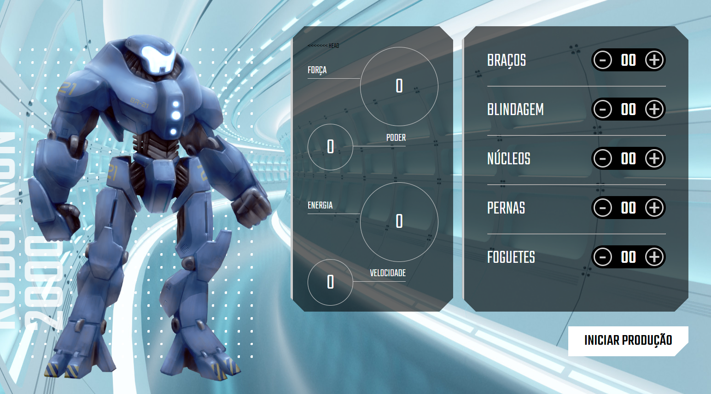

<h1 align="center">ALURA JavaScript para Web: Crie páginas dinâmicas</h1>

## :dart: Objetivos do Estudo
Projeto elaborado com base no curso "JavaScript para Web: Crie páginas dinâmicas" da plataforma Alura que faz parte da formação "JavaScript: Manipulando o DOM", nesta aplicação foi ensinado as seguintes funções:

- JavaScript para WEB
   - Manipular um elemento
   - Sobre o DOM
   - Entendendo o DOM

- Interagindo com uma página
   - Eventos com JavaScript
   - EventListener & querySelector
   - Funções com JavaScript
   - Para saber mais: Hoisting no JavaScript
   - Tipos de funções

- Montando uma peça
   - Alterando um item na página
   - Reaproveitando código
   - Alterando vários componentes
   - Para saber mais: para que serve um Array?
   - Consultando uma lista

- Montando o Robô
   - Alterando o elemento
   - Código à prova de falhas
   - Para saber mais: data-attribute
   - Definindo data-attributes

- Calculando o poder
   - Interagindo com objetos
   - Cálculos dinâmicos
   - Compartilhando com o mundo
   - Para saber mais: objetos em JavaScript
   - Utilizando this

## :heavy_check_mark: Design do Projeto

